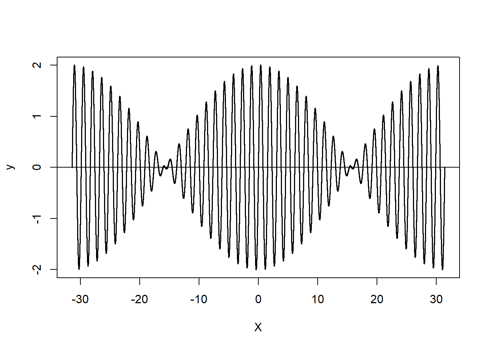

---
output:
  html_document: default
  word_document: default
---
# Produção de gráficos com 
## Tópico: Somatório de ondas harmônicas.





**Resumo:** Através deste trabalho mostro como trabalhar várias funções e como implementar técnicas rápidas e simples de programação, utilizando a linguaguem R, e ao mesmo tempo dando uma noção de como formar ondas harmônicas através de dados e ao final produzindo gráficos que mostram o comportamento destas ondas.

### Aprendendo programação em R e como pensar a teoria das ondas clássicas.

- Decidi fazer um passo a passo de como programar em R, para exibição de gráficos de ondas harmônicas. Para leitura deste artigo, não é necessário entender nenhum desses conceitos, mas toda informação prévia é muito bem utilizada. 


### Gerando o gráfico mais simples 

- Utilizando RStudio, vamos mostrar como fazer um gráfico com as funções mais simples de todas: "seq" e "plot". A primeira, cria uma sequencia de acordo com os parâmetros  e a segunda lista diretamente um gráfico (padrão XY).

- Primeiramente, vamos fazer um gráfico qualquer em R. Através da função seq, geramos uma sequencia de 1 a 20, incrementando de 1 em 1. 


```r
# Atribuindo uma sequencia de 0 a 20
x = seq(0,20, 1)
# Listando a sequencia 
x
```

```
##  [1]  0  1  2  3  4  5  6  7  8  9 10 11 12 13 14 15 16 17 18 19 20
```

```r
# Grafico desta sequencia
plot(x)
```


- Como chamei a função plot com um array de 1 dimensão, o eixo horizontal assume seus valores como a sua posição (ordem) no array. 

- A função plot lista a sequência. Com estes dois fundamentos vamos demonstrar como modelar segmentos de ondas. 


### Gráfico de uma função de onda 

- Já pulando alguns passos, vou fazer o próximo gráfico da função seno de x. Como as ondas tem caráter senoidal, o próximo gráfico já representa uma onda. 

- Para melhorar a qualidade do gráfico, eu diminui o incremento da sequencia, ou seja, cada ponto será acrescido de 0.1, gerando mais pontos no gráfico, ou seja, vamos aumentar nossa sequencia x, para um conjunto maior, de 200 elementos. . 


```r
x = seq(0,20, 0.1)
plot(sin(x))
```


 
- Para quem já tem conhecimento sobre ondas harmônicas e alguma coisa sobre R, por aqui já é suficiente para todo o desenvolvimento restante. Mas vamos no passo a passo. 

- Vemos que o gráfico acima é equivalente a um pouco mais de três comprimentos de onda. Cada comprimento de onda (lambda) é o tamanho no eixo horizontal onde temos uma repetição.

### Gráfico com comprimentos de onda inteiros

- Iniciando uma sequencia com multiplos de PI

- O primeiro ajuste é iniciar e terminar a sequência de dados com múltiplos de Pi. Lembrando que `sin(n * PI) = 0`. Desta forma o gráfico fica com comprimentos de onda inteiros. Ainda vemos que o n representa a quantidade de ondas.


```r
x <- seq(-2*pi, 2*pi, 0.01)
plot( x , sin(x) ) 
abline(h=0)
abline(v=0)
```


- Aqui já temos um segmento de onda, podendo ser a representação da fotografia do movimento de uma corda. 

### De ondas simples para ondas complexas

- Na primeira figura, vemos uma onda complexa com dois comprimentos de onda representados. 

- A grande maioria dos sons que ouvimos, das ondas que enxergamos, que utilizamos nas comunicações, são ondas complexas, ou seja, possuem diversos comprimentos de onda e cada comprimento de onda é equivalente a uma frequencia. Estes comprimentos de onda, quando são múltiplos são chamados comprimentos de ondas harmônicos. 

- Criando um vetor de 1 a  4 (diferentes frequencias/comprimentos de onda)

### Listando quatro ondas harmônicas no mesmo gráfico.

#### Script para montar vários harmônicos (ondas com frequencia múltiplas)

- Iniciando uma sequencia para representar dois comprimentos de onda.

- Iniciando um vetor com os números 1 a 4, que serão usados como multiplicadores.


```r
x <- seq(-2*pi, 2*pi, 0.01)
harm <- seq(1,4)
```

- inicializando vetores 

```r
serie = c()
eixox = c()
cores = c()
```

- A cada loop, a série incrementa a série anterior.

- o conteudo da série é sen(x), sen(2x), ... 

- Matematicamente, o que multiplica o X, é a frequência angular (w), sendo f a frequência da onda.

$$w = 2\pi f$$
    

```r
for (i in 1:length(harm))
{
  serie = c( serie, sin(x*harm[i]) )
  eixox = c( eixox, x )
  cores = c( cores, rep(i, length(x)))
}
```

- Agora a série contém valores de todos os harmônicos em sequência. E as cores servem para diferenciar cada harmônico.

- Veja que o tamanho da série é quatro vezes o tamanho original de x, pois o loop realizou quatro voltas. 

- Através da função length() podemos ver o tamanho do vetor x `length(x)` e do vetor série `length(serie)`


```
## [1] "length(x) =  1257 , length(serie) =  5028"
```
- Transformando o vetor em matriz XY. 


```r
sobrepostos = matrix( c(eixox, serie), ncol=2)
dim(sobrepostos)
```

```
## [1] 5028    2
```

- Agora listando todas no mesmo gráfico. 


```r
title1 <- 'Ondas Múltiplas'

plot(sobrepostos, cex = 0.2, col=cores, xlab = 'X', ylab = 'y', main = title1)
abline(h=0)
```


### Onda resultante (unificar as quatro ondas)


```r
x <- seq(-2*pi, 2*pi, 0.01)
harm <- seq(1,4)

serie = sin(x*harm[1]) 
eixox = c(x)
cores = rep(1, length(x))

# ao invés de concatenar, agora vamos somá-los.

for (i in 2:length(harm))
{
  serie = serie + sin(x*harm[i]) 
}

ondaunica = matrix( c(eixox, serie), ncol=2)
```

- A onda única é resultado do somatório dos pontos em Y para cada posição do eixo x. Veja acima que o vetor eixox não sofre alteração de uma onda para a outra. 

- Como estamos trabalhando com somatório, a onda resultante contém menos dados, pois ela é o agrupamento das posições do eixo x através do somatório das posições repetidas em Y.


```r
dim(ondaunica)
```

```
## [1] 1257    2
```


- Listando a onda resultante. 


```r
title1 <- 'Somatório de Ondas'

plot(ondaunica, cex = 0.2, xlab = 'X', ylab = 'y', main = title1)
abline(h=0)
```


### Onda resultante mais 'Natural'

- Na natureza, a produção de ondas com frequencias multiplas, que dão origem às notas harmonicas tem origem no fenomeno da reflexão. Por outro lado, e apesar da conservação de energia, a maioria das interações físicas possuem característica da resistência ao movimento, gerando assim uma diminuição da energia. Desta forma não é estranho pensar que a energia e por consequencia, a amplitude da onda seja menor a cada reflexão. 

- Para implementar a amplitude, vamos atribuir pessos a cada uym dos harmônicos. Abaixo, o novo array `pesos`, iniciado como `c(100, 80, 80, 60) ` mostra 100% para a primeira frequencia (a fundamental) e um leve decaimento até a quarta frequência. 


```r
x <- seq(-4*pi, 4*pi, 0.01)
harm <- seq(1,4)
pesos <- c(100, 80, 80, 60) 

serie = pesos[1]*sin(x*harm[1]) 
eixox = c(x)
cores = rep(1, length(x))

# ao invés de concatenar, agora vamos somá-los.

for (i in 2:length(harm))
{
  serie = serie + pesos[i]*sin(x*harm[i]) 
}

ondaunica = matrix( c(eixox, serie), ncol=2)

title1 <- 'Onda Resultante (Variando amplitude harmonicos)'

plot(ondaunica, cex = 0.2, xlab = 'X', ylab = 'y', main = title1)
abline(h=0)
```


### Onda resultante de instrumentos musicais

- Os instrumentos musicais possuem uma arquitetura corporal e de ressonância que permite a formação de diferentes harmônicos, o que leva a um **timbre** diferente que permite a diferenciação auditiva. Uma mesma nota (frequencia fundamental), emitida por instrumentos diferentes são diferentes. Como se explica? 

- O **timbre** é o próprio resultado da distribuição harmônica, e a nota que identificamos é a **frequência** da onda resultante. Como se pode ver abaixo, apesar de diferentes distribuições, o comprimento de onda se mantém semelhante ao comprimento de onda da nota mais grave, ou seja, a *frequência fundamental*.

- Primeiramente vamos aumentar o número de harmônicos sensíveis para 10 e modular os pesos destes harmônicos de forma diferente.

- Depois, estes pesos diferentes serão aplicados a cada uma das ondas antes de somá-las, trazendo assim a característica de amplitudes diferentes para cada múltiplo.


```r
x <- seq(-6*pi, 6*pi, 0.01)
harm <- seq(1,10)
pesos <- c(100, 90,  80,  70,  60,  50,  40,  30,  20,  10 )
pesos <- seq(100, 10, -10)

pesos2<- c(100,  0,  80,   0,  60,   0,  40,   0,  20,   0 ) 
pesos3<- c(100,  0,   0,  70,   0,   0,  40,   0,   0,  10 )
pesos4<- c(100,  0,   0,   0,  60,   0,   0,   0,  20,   0 ) 
pesos5<- c(100,  0,   0,   0,   0,  50,   0,   0,   0,   0 ) 
pesos6<- c(100,  0, 100,   0, 100,   0, 100,   0, 100,   0 ) 
#Instrumentos de sopro com comportamento anômalo, com pedal no terceiro ou quinto harmonico
pesos7<- c( 50, 60, 100,  90,  70,  60,   0,   0,   0,   0 ) 
pesos8<- c( 60, 70,  80,  90, 100,  90, 80,  70,   60,  50 ) 
pesos9<- c( 0,100, 100, 0,   0, 0,  0,  0,   0,  0 ) 

for (instru in 1:9) {
  
    # Em cada loop, assume um tipo de distribuição de pesos de cada harmônico
    if(instru==2) {pesos <- pesos2}
    if(instru==3) {pesos <- pesos3}
    if(instru==4) {pesos <- pesos4}
    if(instru==5) {pesos <- pesos5}
    if(instru==6) {pesos <- pesos6}
    if(instru==7) {pesos <- pesos7}
    if(instru==8) {pesos <- pesos8}
    if(instru==9) {pesos <- pesos9}
    
    
    serie = pesos[1]*sin(x*harm[1]) 
    eixox = c(x)
    cores = rep(1, length(x))
    
    # ao invés de concatenar, agora vamos somá-los.
    
    for (i in 2:length(harm))
    {
      serie = serie + pesos[i]*sin(x*harm[i]) 
    }
    
    ondaunica = matrix( c(eixox, serie), ncol=2)
    
    
    title1 <- paste('Onda Resultante: ( Simulação' , instru , ')' ) 
    
    plot(ondaunica, cex = 0.2, xlab = 'X', ylab = 'y', main = title1)
    abline(h=0)
}
```


### Batimento 

- O batimento é o resultado do somatório de duas ondas com frequências semelhantes. A Característica do batimento é escutarmos a média entre as frequencias e simultaneamente escutamos uma frequencia muito baixa, resultado da oscilação da amplitude, dando a sensação do som que aumenta e diminui.

- É muito comum ao afinar instrumentos de corda que este batimento sirva de referência para a afinação, ou seja, ao parar de escutar o batimento, se sabe que as duas frequencia estão iguais.

- Abaixo uma amostra (com 16 comprimentos de onda), onde as frequencias base são: $$f1=4\pi,  f2=4.1\pi$$. A frequencia resultante será a média, e uma frequência mais baixa (maior comprimento de onda) do batimento: $$fm=4.05\pi, fb=0.1\pi$$


- 

- 

```r
for(nBat in c(2,3,3) )
{
  x <- seq(-(nBat^2)*pi , (nBat^2)*pi, 0.001)
  harm <- c(4*pi,4.1*pi)
  
  serie = sin(x*harm[1]) 
  eixox = c(x)
  cores = rep(1, length(x))
  
  for (i in 2:length(harm))
  {
    serie = serie + sin(x*harm[i]) 
  }
  
  ondaunica = matrix( c(eixox, serie), ncol=2)
  
  title1 <- ''
  
  plot(ondaunica, cex = 0.2, xlab = 'X', ylab = 'y', main = title1)
  abline(h=0)
}
```


```r
# Ultimo gráfico, traçar a curva do batimento
serie = serie + sin(x* 0.1 * pi)

plot(ondaunica, cex = 0.2, xlab = 'X', ylab = 'y', main = title1)
```


